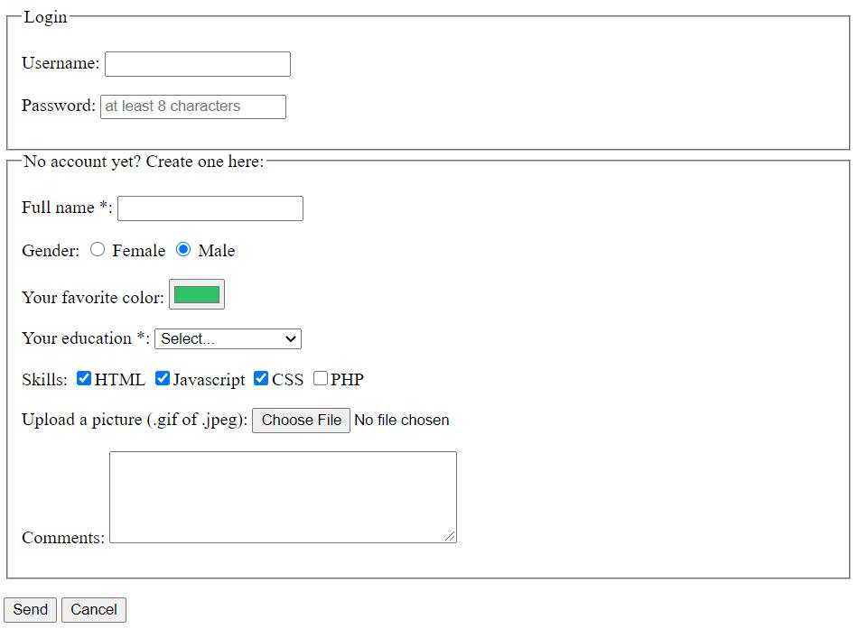

# Oefening
Werk dit onderstaand formulier zo goed mogelijk na.

Nodige elementen :
* fieldset + legend
* input type text, password, radio, checkbox, file, color, submit
* option + select
* textarea
* label

Voorzie ook validatie voor volgende zaken:
* full name is ingevuld
* Password is langer dan 8 karakters
* Education is gekozen
* Minstens 1 skill is aangeduid
* Er is een file gekozen

Bij cancel wordt het formulier gereset.